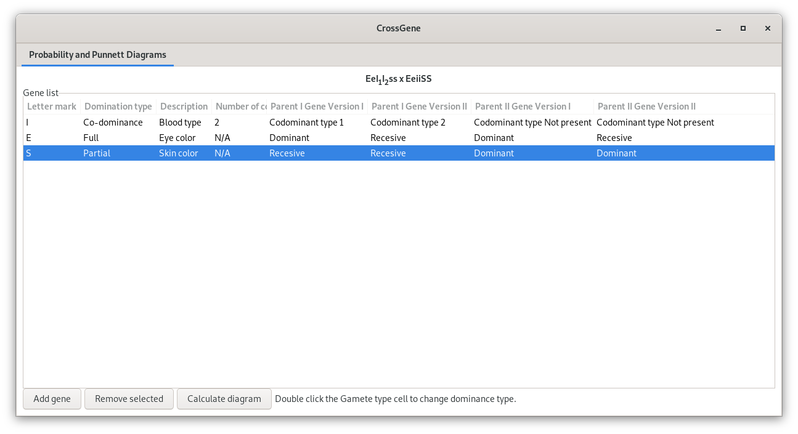
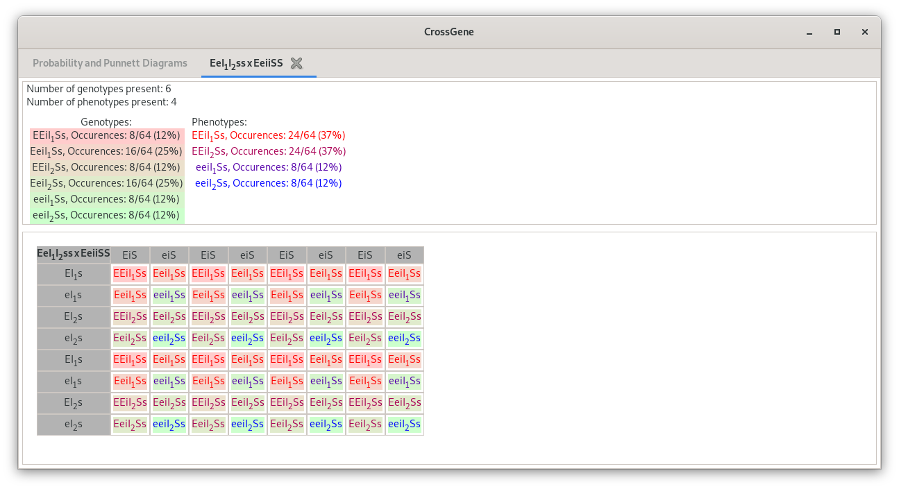

# CrossGene
CrossGene is a software that biology (and related) students might find usefull.

CrossGene allows you to set which genes you would like to cross and
the type of domination that each gene exhibits. 

After setting the required gene types, a Punnett diagram can be created,
along with coloring and probability calculation for each
genotype and phenotype. 

CrossGene base is finished and ready to use, but I plan to add more features in the future, like:
- saving diagrams/loading diagrams
- exporting diagrams as .png files
- and more!
